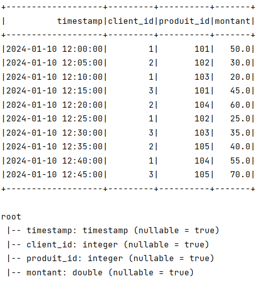
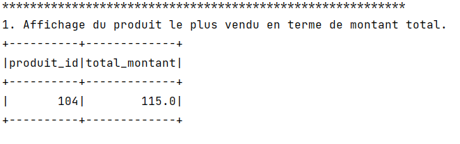
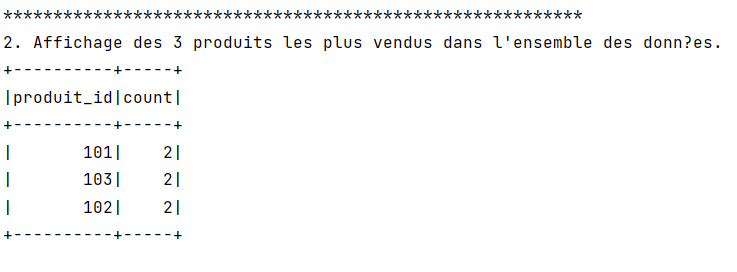
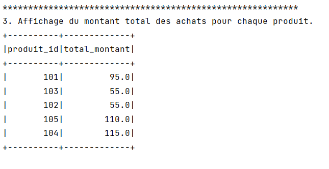

### Projetct Tree
```
.
├───src
│   ├───main
│   │   ├───java
│   │   │   └───ma
│   │   └───resources
│   └───test
│       └───java
├───target
│   ├───classes
│   │   └───ma
│   ├───generated-sources
│   │   └───annotations
│   ├───maven-archiver
│   └───maven-status
│       └───maven-compiler-plugin
│           ├───compile
│           │   └───default-compile
│           └───testCompile
│               └───default-testCompile
└───volumes
    ├───spark-master
    ├───spark-worker-1
    └───spark-worker-2

```
## Deployoment en Docker

### Build jar avec mvn
```bash
    mvn clean package
```

## Pull butnami/spark image
```bash
    docker pull bitnami/spark:latest
```

## Executer Docker compose
```bash
    docker compose up -d
```

## Copier le fichier jar dans le dossier `volumes/spark-master`
```bash
    docker cp target/exam-ii-1.0-SNAPSHOT.jar exam-ii-spark-master-1:/bitnami 
```

## Copier le fichier csv dans le mapped volume

In This example we copy the file `data.csv` into the folders:
- `volumes/spark-master`
- `volumes/spark-worker-1`
- `volumes/spark-worker-2`

## Executer le fichier jar dans le conteneur master
```bash
docker-compose exec -it spark-master spark-submit --master spark://spark-master:7077 --class ma.Main /bitnami/exam-ii-1.0-SNAPSHOT.jar```
```

## Execution 


```java
        System.out.println("1. Affichage du produit le plus vendu en terme de montant total.");
        dataset.groupBy("produit_id").agg(sum("montant").as("total_montant"))
        .orderBy(col("total_montant").desc())
        .limit(1)
        .show();
```



```java
System.out.println("2. Affichage des 3 produits les plus vendus dans l'ensemble des données.");
        dataset.groupBy("produit_id").count()
                .orderBy(col("count").desc())
                .limit(3)
                .show();
```


```java
System.out.println("3. Affichage du montant total des achats pour chaque produit.");
        dataset.groupBy("produit_id").agg(sum("montant").as("total_montant"))
                .show();
```

