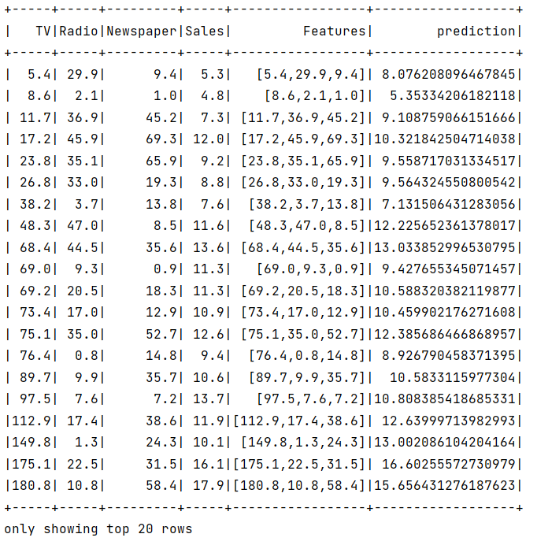
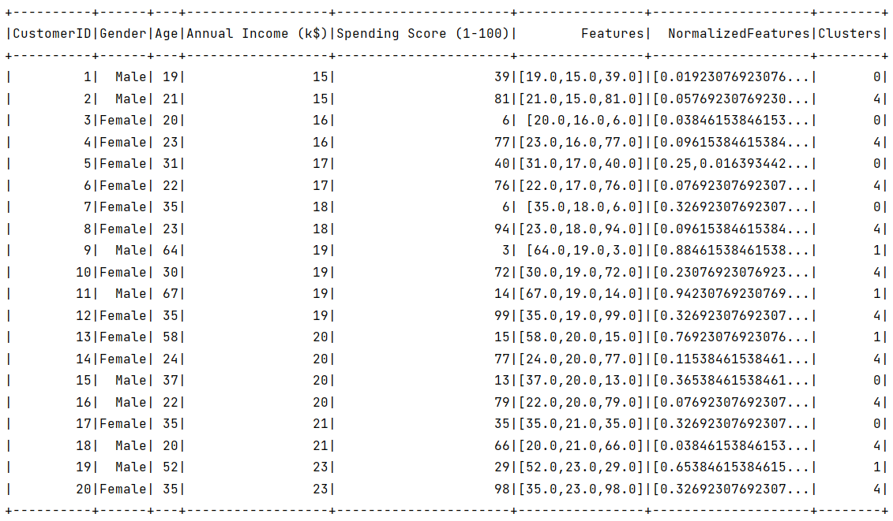
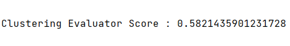

# Spark ML

### Linear Regression
Performing linear regression on advertising data using **Apache Spark's MLlib** library as follows :

1. **Initialization:**
    - `SparkSession` is created to utilize Spark functionalities.
    - A dataset is loaded from a CSV file named "advertising.csv" with options set to infer the schema and consider the first row as a header.

2. **Data Preparation:**
    - `VectorAssembler` is used to combine selected columns (`"TV"`, `"Radio"`, and `"Newspaper"`) into a single feature column named `"Features"`.

3. **Data Splitting:**
    - The dataset is split randomly into training (80%) and testing (20%) subsets using `randomSplit`.

4. **Model Building:**
    - `LinearRegression` from MLlib is employed to create a linear regression model.
    - The label column is set to `"Sales"`, and the feature column is set to `"Features"`.
    - The model is trained using the training data.

5. **Model Evaluation:**
    - The trained model is used to make predictions on the test data with `model.transform`.
    - The results are displayed using `tests.show()`, showcasing predicted sales values.

### KMeans

Performing K-means clustering on a dataset containing information about mall customers as follows :

1. **Initialization:**
    - `SparkSession` is set up to use Spark functionalities.
    - A dataset is loaded from a CSV file named "Mall_Customers.csv" with options to infer the schema and consider the first row as a header.

2. **Data Preparation:**
    - `VectorAssembler` is employed to assemble selected columns (`"Age"`, `"Annual Income (k$)"`, `"Spending Score (1-100)"`) into a single feature column named `"Features"`.

3. **Data Scaling:**
    - `MinMaxScaler` is used to normalize the assembled features to a specific range. The input column is `"Features"`, and the output column is named `"NormalizedFeatures"`.

4. **Model Training:**
    - `KMeans` from MLlib is used to create a K-means clustering model.
    - It's configured to generate 5 clusters (`setK(5)`) and is fed the normalized features.
    - The model is trained using `fit` on the scaled dataset.

5. **Prediction and Evaluation:**
    - The trained model is used to predict clusters for each data point in the dataset with `model.transform`.
    - Predictions are shown (`predictions.show()`).

6. **Evaluation Metric:**
    - A `ClusteringEvaluator` is instantiated to evaluate the clustering performance.
    - The evaluator is configured with the features and prediction columns.
    - The evaluation score is calculated using `evaluate` on the predictions dataset.

**The evaluation score**

