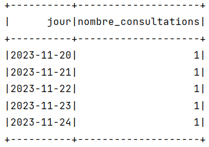

# Spark SQL

### Part I
The goal is to develop a Spark application for an industrial company that handles incidents from each service. These incidents are stored in a CSV file with the following data format: Id, title, description, service, date.

##### 1. Display the count of incidents per service.


##### 2. Display the two years with the highest number of incidents.


### Part II

The objective is to read data for a mySQL database, then to leverage Spark SQL through DataFrame and Dataset APIs to extract valuable insights from this data, aiding in decision-making processes.

First, we create the following tables in mySQL databse titled "DB_HOPITAL".

##### Table PATIENTS structure


Create the table `PATIENTS` structure.
```SQL
CREATE TABLE `PATIENTS` (
  `id` INT NOT NULL AUTO_INCREMENT,
  `nom` VARCHAR(50) NOT NULL,
  `prenom` VARCHAR(50) NOT NULL,
  `cin` VARCHAR(50) NOT NULL,
  `tel` VARCHAR(50) NOT NULL,
  `email` VARCHAR(50) NOT NULL,
  `date_naissance` DATE NOT NULL,
  PRIMARY KEY (`id`)
);
```
To insert multiple rows of fake data, you can use a loop or a stored procedure. For example, the following stored procedure inserts 20 rows of fake data into the `PATIENTS` table:
```SQL
DELIMITER //
CREATE PROCEDURE generate_patients()
BEGIN
  DECLARE i INT;
  SET i = 0;
  WHILE i < 20 DO
    INSERT INTO `users` (`nom`, `prenom`, `cin`, `tel`, `email`, `date_naissance`)
    VALUES (CONCAT('John Doe ', i), CONCAT('Jane Doe ', i), CONCAT('123456789', i), CONCAT('123-456-', i * 1000), CONCAT('john.doe', i, '@example.com'), CONCAT('1980-01-', i));
    SET i = i + 1;
  END WHILE;
END //
DELIMITER ;
CALL generate_patients();
```

##### Table MEDECINS structure


Create the table `MEDECINS` structure.
```SQL
CREATE TABLE `MEDECINS` (
                            `ID` INT NOT NULL AUTO_INCREMENT,
                            `NOM` VARCHAR(50) NOT NULL,
                            `PRENOM` VARCHAR(50) NOT NULL,
                            `EMAIL` VARCHAR(50) NOT NULL,
                            `TEL` VARCHAR(20) NOT NULL,
                            `SPECIALITE` VARCHAR(50) NOT NULL,
                            PRIMARY KEY (`ID`)
);
```
Insert fake data into the `MEDECINS` table is to use the following SQL statement:
```SQL
INSERT INTO `MEDECINS` (`NOM`, `PRENOM`, `EMAIL`, `TEL`, `SPECIALITE`)
VALUES ('Dr. Doe', 'John', 'john.doe@example.com', '123-456-7890', 'General Medicine'),
('Dr. Doe', 'Jane', 'jane.doe@example.com', '123-456-7891', 'Pediatrics'),
('Dr. Smith', 'Bob', 'bob.smith@example.com', '123-456-7892', 'Cardiology'),
('Dr. Smith', 'Mary', 'mary.smith@example.com', '123-456-7893', 'Dermatology'),
('Dr. Jones', 'Susan', 'susan.jones@example.com', '123-456-7894', 'Orthopedic Surgery');

```

##### Table CONSULTATIONS structure


Create the table `CONSULTATIONS` structure.
```SQL
CREATE TABLE `CONSULTATIONS` (
  `ID` INT NOT NULL AUTO_INCREMENT,
  `ID_MEDECIN` INT NOT NULL,
  `ID_PATIENT` INT NOT NULL,
  `DATE_CONSULTATION` DATE NOT NULL,
  PRIMARY KEY (`ID`),
  FOREIGN KEY (`ID_MEDECIN`) REFERENCES `MEDECINS` (`ID`),
  FOREIGN KEY (`ID_PATIENT`) REFERENCES `PATIENTS` (`ID`)
);
```
Insert fake data into the `CONSULTATIONS` table, you can use the following SQL statement:
```SQL
INSERT INTO `CONSULTATIONS` (`ID_MEDECIN`, `ID_PATIENT`, `DATE_CONSULTATION`)
VALUES (1, 1, '2023-11-24'),
(2, 2, '2023-11-23'),
(3, 3, '2023-11-22'),
(4, 4, '2023-11-21'),
(5, 5, '2023-11-20');
```

##### Display the number of consultations per day


##### Display the number of consultations per doctor


##### Display for each doctor, the number of patients they have assisted
